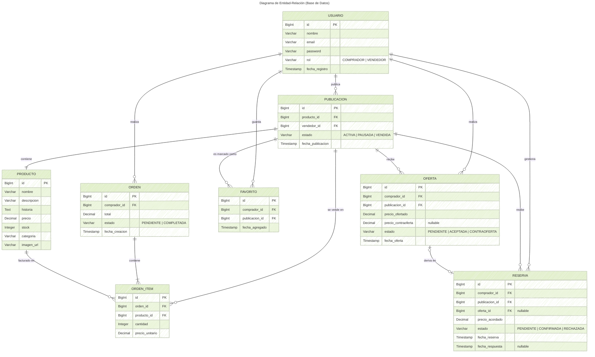
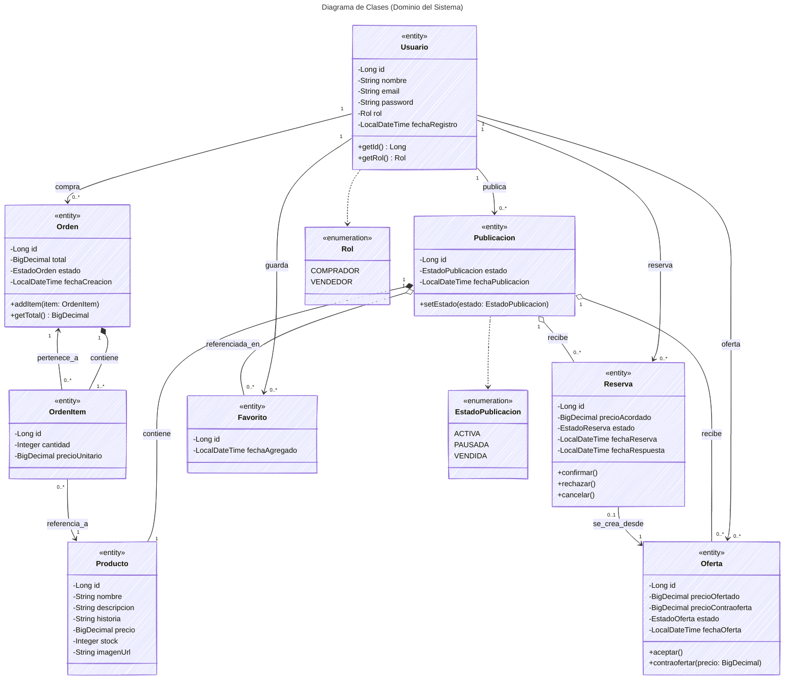

# Resolución de la Consigna (UVA 1) - The Collector

A continuación se presentan el **Diagrama de Entidad-Relación (DER)** y el **Diagrama de Clases UML**, aplicando las mejores prácticas y configuración avanzada de diseño de diagramas de software.

---

## 1. Diagrama de Entidad-Relación (DER)

Este DER detalla de forma explícita las entidades principales y secundarias del sistema e identifica sus Claves Primarias (PK) y Foráneas (FK). Se utilizan las relaciones "Crow's foot" con multiplicidad explícita.

---

## 2. Diagrama de Clases UML (Modelo de Dominio / JPA)

Este modelo diagrama las entidades bajo el paradigma orientado a objetos (enfocado en el traslado a un framework como Spring Boot). Incorpora estereotipos `<<entity>>` y `<<enumeration>>`, visibilidad correcta de los miembros y multiplicidades explícitas en las líneas de relación.

